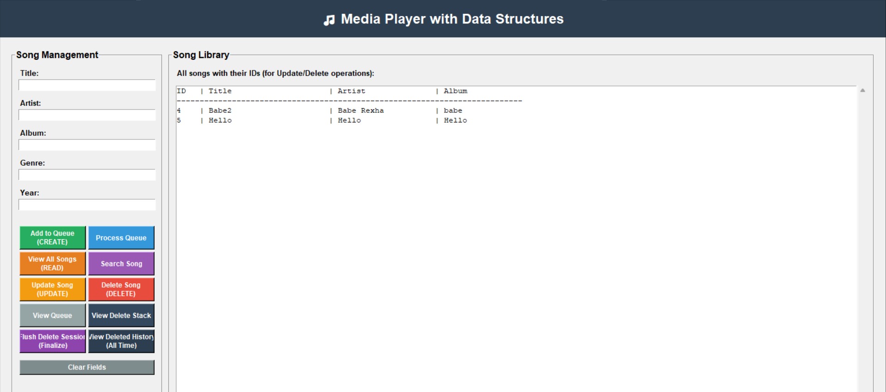
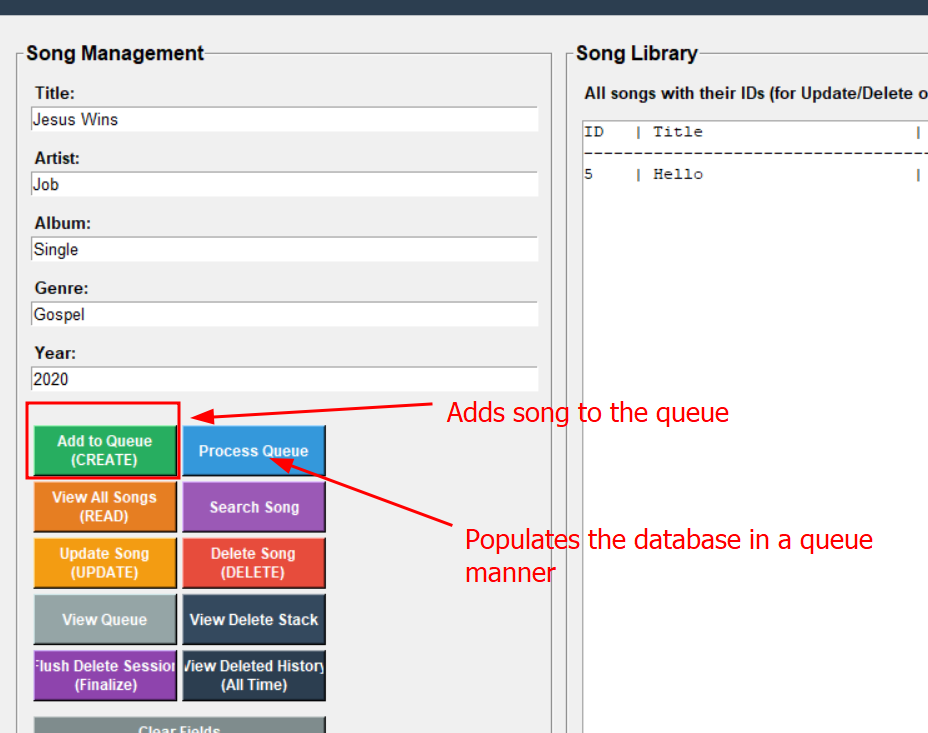
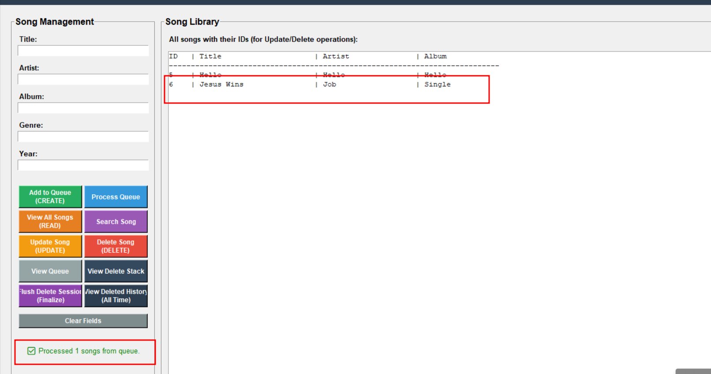
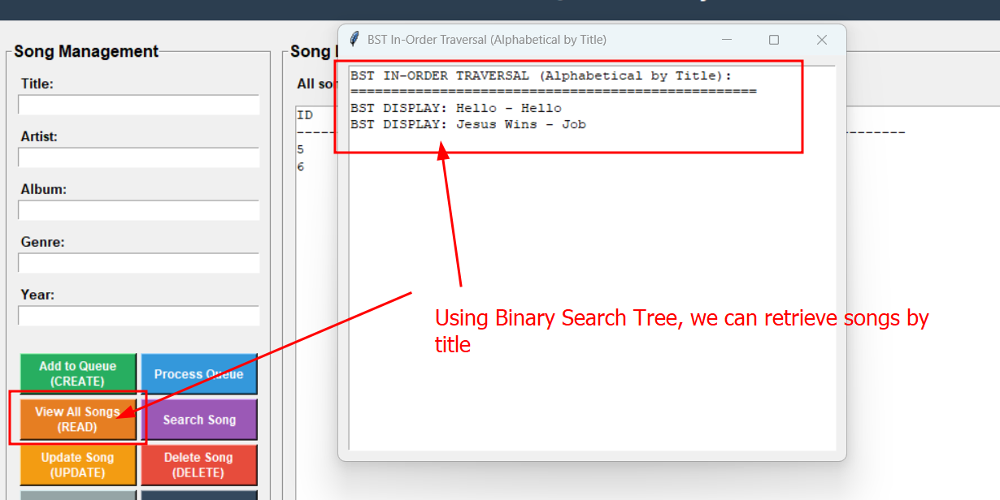
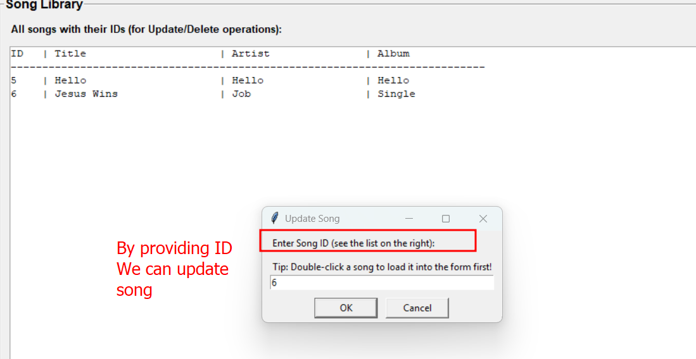
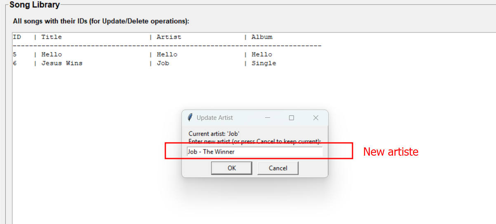
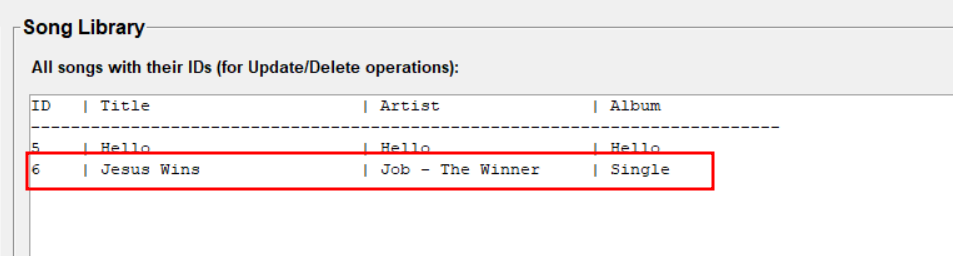
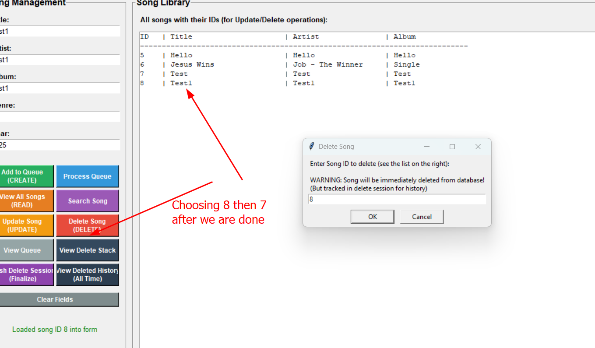
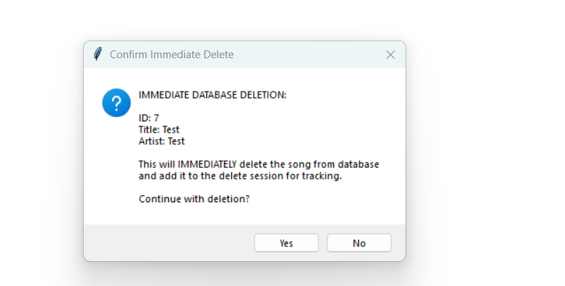
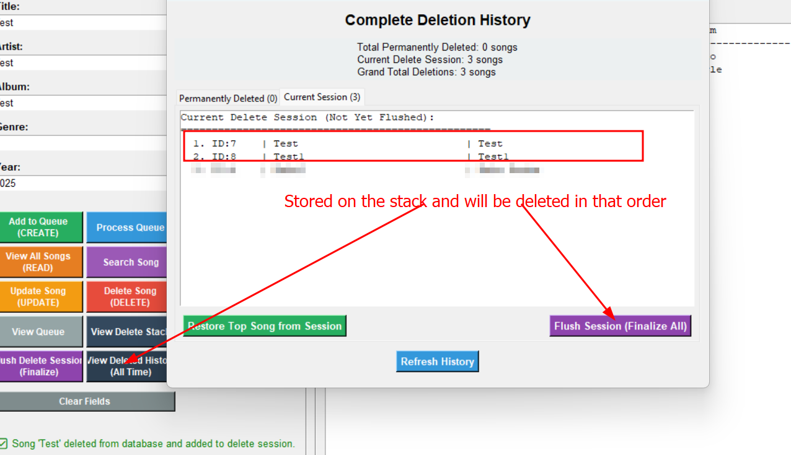

# Media Player with Data Structures
## Installation Instructions
1. Ensure git is installed
```powershell
PS C:\Users\manot\AppData\Local\Temp> git --version
git version 2.45.2.windows.1
```

2. Using git, clone the repository:
```powershell
PS C:\Users\manot\AppData\Local\Temp> git clone https://github.com/ICS-2025-GROUP-F/dsa-sem-project-cousins_dsa

Cloning into 'dsa-sem-project-cousins_dsa'...
remote: Enumerating objects: 220, done.
remote: Counting objects: 100% (14/14), done.
remote: Compressing objects: 100% (14/14), done.
remote: Total 220 (delta 0), reused 0 (delta 0), pack-reused 206 (from 1)
Receiving objects: 100% (220/220), 48.14 KiB | 112.00 KiB/s, done.
Resolving deltas: 100% (102/102), done.
PS C:\Users\manot\AppData\Local\Temp>
```

3. Enter the repository:
```powershell
PS C:\Users\manot\AppData\Local\Temp\dsa-sem-project-cousins_dsa> ls

    Directory: C:\Users\manot\AppData\Local\Temp\dsa-sem-project-cousins_dsa

Mode                 LastWriteTime         Length Name
----                 -------------         ------ ----
d----           7/14/2025  4:34 PM                .github
d----           7/14/2025  4:34 PM                .idea
d----           7/14/2025  4:34 PM                media_player_ds
-a---           7/14/2025  4:34 PM            232 .gitignore
-a---           7/14/2025  4:34 PM            531 README.md
-a---           7/14/2025  4:34 PM           5453 semester_project_brief.md

PS C:\Users\manot\AppData\Local\Temp\dsa-sem-project-cousins_dsa>
```

4. Install python dependencies:
```powershell
PS C:\Users\manot\AppData\Local\Temp\dsa-sem-project-cousins_dsa> cd .\media_player_ds\
PS C:\Users\manot\AppData\Local\Temp\dsa-sem-project-cousins_dsa\media_player_ds> pip3 install -r .\requirements.txt
```

## Application Usage
Run the python application:
```powershell
python main.py
```


### Create Songs using Queue Operations

- By creating multiple songs and clicking the **Process Queue** button. We can fill in the songs.


### Reading Songs using Binary Search Algorithm

- The program uses binary search tree to find all the songs.

### Updating Songs using Hashmap Table

By selecting the **Update Song** option, we can be able to change the value of any feature and see the changes.



- We get the update feature working!

### Deleting Songs using a stack
- We first implement a soft delete feature, to load the items onto the stack. Then delete them in the LIFO principle.

We will create some 2 songs, then proceed to delete them. `ID=7 & 8`



Once done, we can permanently delete them:



